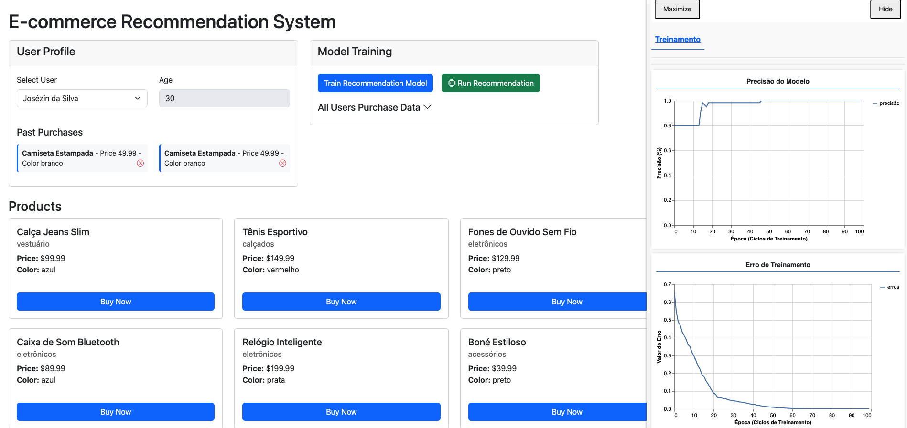

# NeuroCart

NeuroCart is an AI-powered e-commerce intelligence platform designed to predict user preferences and deliver highly personalized shopping experiences.

By leveraging machine learning models, NeuroCart analyzes user behavior, interactions, and purchase patterns to anticipate what customers are most likely to buy — before they even search for it.

## 🚀 Key Features

- 🤖 Machine Learning recommendation engine
- 🧠 Behavioral analysis and preference prediction
- 🛒 Smart product suggestions in real time
- 📊 Scalable architecture with API integration
- ⚡ Optimized for performance and modern e-commerce systems

## 🧩 How It Works

NeuroCart collects and processes user interaction data, including:
- Browsing behavior
- Purchase history
- Product engagement

Using this data, it trains intelligent models (e.g., TensorFlow.js) to generate accurate and dynamic recommendations, improving conversion rates and user experience.

## 🛠 Tech Stack

- Node.js
- MongoDB
- REST API architecture
- TensorFlow.js (for ML models)

## 🎯 Vision

To redefine e-commerce personalization by making intelligent product recommendations faster, smarter, and more human-like.

---

NeuroCart transforms data into decisions — delivering the right product, to the right user, at the right time.


___________________________________________________________________________


# E-commerce Recommendation System (MongoDB + API Architecture)

A web application that displays user profiles and product listings, with the ability to track user purchases and serve as a foundation for future machine learning recommendations using TensorFlow.js. 

The system has been evolved into a more robust and production-oriented architecture, now powered by a backend API and MongoDB for scalable data management.


## Demo



## Overview

Originally built using static JSON files, this project has been upgraded to a professional architecture that includes:

- A Node.js + Express API layer
- MongoDB as the primary data source
- Clear separation between frontend and backend

This evolution improves scalability, maintainability, and aligns the application with real-world development standards.

## Architecture

- **Frontend**: Static files (HTML, JS) served via Express
- **Backend API**: Node.js with Express
- **Database**: MongoDB (`ecommerce-aula`)
- **Collections**: `users` and `products`

## Project Structure

- `index.html` → Frontend entry point  
- `src/api/` → Backend API (Express + MongoDB)  
- `src/service/` → Services consuming API endpoints  
- `src/workers/` → Background processing (ML training)  
- `sql/` → Initial data for MongoDB  
- `data/` → Legacy JSON files (deprecated)

## MongoDB Setup

### 1. Create Database

```
ecommerce-aula
```

### 2. Create Collections

```
users
products
```

### 3. Import Initial Data

Data is available inside `/sql`.

#### MongoDB Compass
1. Connect to MongoDB
2. Create database `ecommerce-aula`
3. Create collections
4. Import JSON files


## Environment Configuration

Configure `.env`:

```
MONGODB_URI=mongodb://192.168.0.128:27017
MONGODB_DB_NAME=ecommerce-aula
PORT=3000
```

## Installation

```
npm install
```

## Seed (optional)

```
npm run seed
```

## Run

```
npm start
```

Access:

```
http://localhost:3000
```

## API Endpoints

- GET `/api/health`
- GET `/api/users`
- GET `/api/products`

## Key Improvements

- Migration from static JSON to MongoDB
- Introduction of REST API layer
- Better scalability and maintainability
- Real-world architecture ready for ML integration

## Future Enhancements

- TensorFlow.js recommendation engine
- Behavioral analysis
- Personalized recommendations
